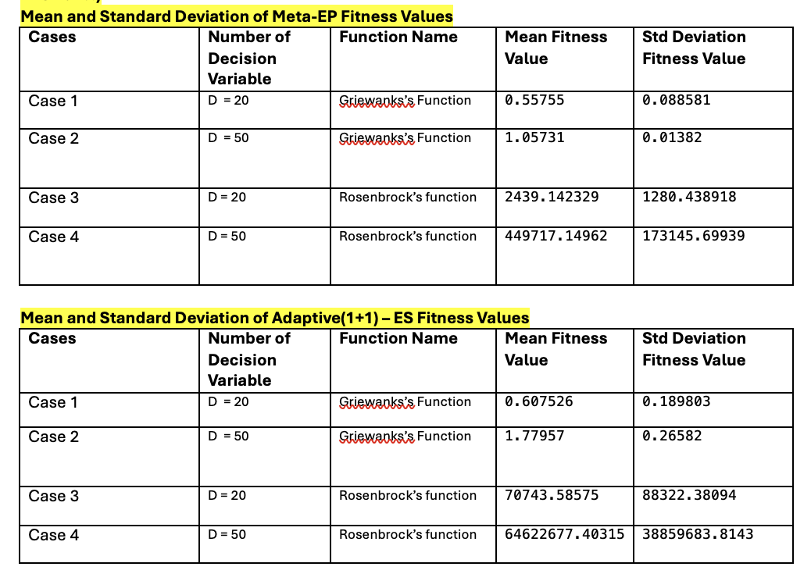

# Question 1: Evolutionary Programming and Evolution Strategy

This question solves the Rosenbrock and Griewank equations using:

- Meta-Evolutionary Programming (Meta-EP)
- Adaptive `(1+1)` Evolution Strategy (ES)

Both notebooks store the best fitness for each generation and plot a convergence curve.

## Configuration

In either notebook, update these variables to change the experiment:

- `EVALUATION_FUNC_NAME` selects `evaluation_rosenbrock` or `evaluation_griewank`.
- `NUM_DECISION_VARIABLES` sets the number of decision variables.

## Notebooks

- `src/evolutionary_pgm_impl.ipynb` — Meta-EP implementation.
- `src/evolutionary_stg_impl.ipynb` — Adaptive `(1+1)` ES implementation.

## Results

### Fitness Summary




## Requirements

Install the required packages with:

```bash
python -m pip install deap numpy matplotlib jupyter
```

## Running the Notebooks

From the repository root, start Jupyter:

```bash
jupyter notebook
```

Open either notebook and run its cells from top to bottom.
