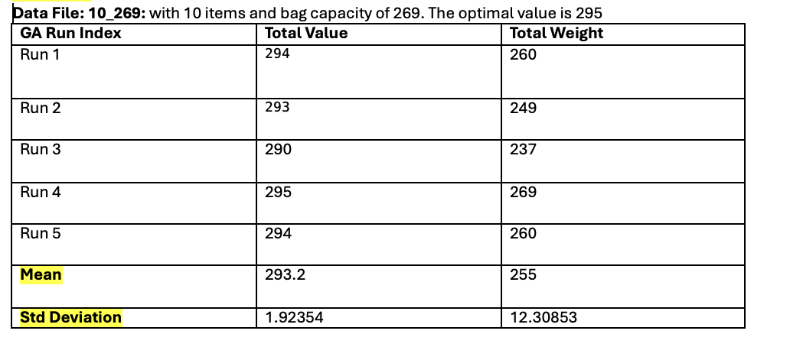
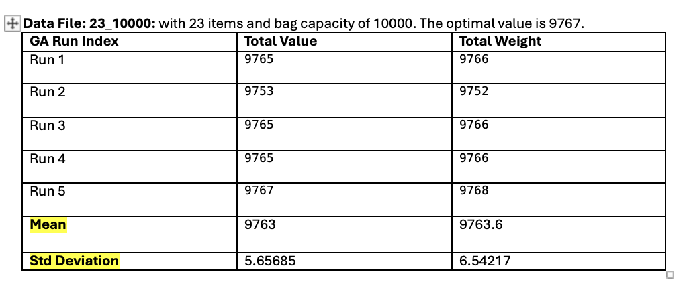
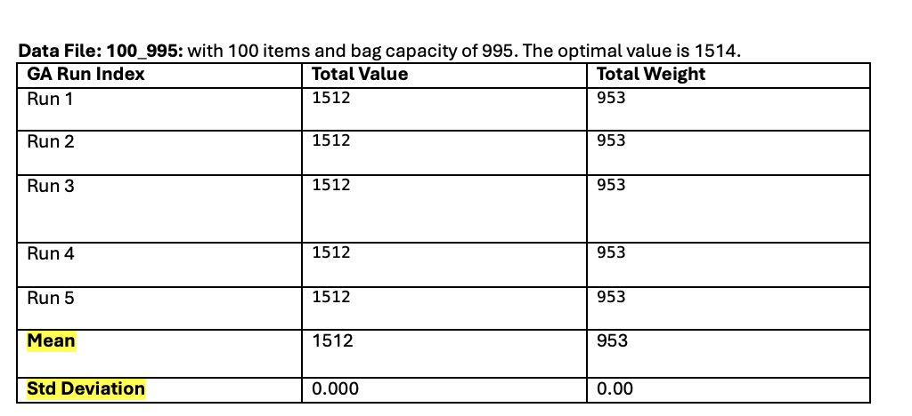

# Question 3: UMDA

The 0/1 knapsack problem is solved using the Univariate Marginal Distribution Algorithm (UMDA).


## Configuration

To use another knapsack dataset, change the input path in
[`knapsack_eda_impl.ipynb`](src/knapsack_eda_impl.ipynb):

```python
num_items, capacity, value_list, weight_list = read_file("../data/100_995")
```

The UMDA parameters, including population size, number of generations,
selection size, elite size, and random seeds, can also be changed in the
notebook.

## Notebook

- [`src/knapsack_eda_impl.ipynb`](src/knapsack_eda_impl.ipynb)

## Results

### Dataset `10_269`

The optimal value is 295.



### Dataset `23_10000`

The optimal value is 9767.



### Dataset `100_995`

The optimal value is 1514.



## Requirements

```bash
python -m pip install deap numpy matplotlib jupyter
```

Run the notebook with:

```bash
jupyter notebook
```
