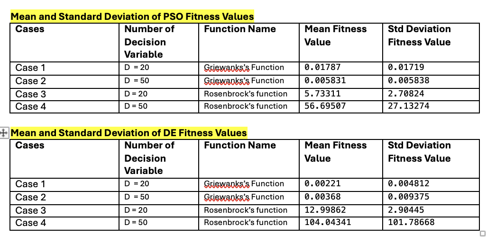

# Evolutionary Computation: Algorithms, Experiments & Applications

This repository explores evolutionary optimisation, population-based search,
probabilistic modelling, and genetic programming for image feature extraction
and classification. It is organised as a set of reproducible experiments that
make the behaviour of different search strategies visible through notebooks,
source code, convergence plots, and generated feature data.

The experiments cover:

- Evolutionary Programming (EP)
- Evolution Strategies (ES)
- Differential Evolution (DE)
- Particle Swarm Optimisation (PSO)
- Estimation of Distribution Algorithms (EDA)
- Genetic Programming (GP)

Together, the experiments investigate how evolutionary methods search complex
solution spaces, how parameter choices influence convergence and variability,
and how evolutionary programs can learn feature extraction pipelines for
facial-expression image classification.

## Experiments

### Evolutionary Programming

**Algorithm.** The EP experiment evolves real-valued candidate solutions using
mutation, fitness evaluation, and best-individual selection. The implementation
is described as Meta-Evolutionary Programming in the accompanying notebook.

**Implementation and setup.** The notebook supports the Rosenbrock and
Griewank objective functions and exposes the number of decision variables,
population size, and generation count as configuration values. The checked-in
configuration uses a population of 50, 50 decision variables, and 1,000
generations. Thirty runs are executed with seeds 1 through 30.

**Evaluation.** Each run records the best fitness by generation and reports
per-seed final fitness values. The stored convergence history is used to
visualise search progress.

**Observed result.** The checked-in notebook output contains a Griewank run
with per-seed final fitness values and a convergence plot. The objective and
configuration can be changed before rerunning, so the output should be
interpreted together with the selected function and seed.

**Code:** [`Q1_EP_ES/src/evolutionary_pgm_impl.ipynb`](Q1_EP_ES/src/evolutionary_pgm_impl.ipynb)

### Evolution Strategies

**Algorithm.** The ES experiment implements an adaptive `(1+1)` Evolution
Strategy. A single parent competes with a mutated offspring, while mutation
scale information is adapted during the run.

**Implementation and setup.** The notebook supports Rosenbrock and Griewank,
uses 50 decision variables, a 50-member initial population, and 1,000
generations in the checked-in configuration. It evaluates seeds 1 through 30.

**Evaluation.** Final fitness is recorded for every seed, with mean and sample
standard deviation reported across runs. A best-fitness convergence trajectory
is plotted.

**Observed result.** The stored Rosenbrock output reports a mean final fitness
of `64,622,677.40315349` and a standard deviation of
`38,859,683.81432349` across the 30 seeds. These values describe the checked-in
run, not a general performance guarantee.

**Code:** [`Q1_EP_ES/src/evolutionary_stg_impl.ipynb`](Q1_EP_ES/src/evolutionary_stg_impl.ipynb)

### Differential Evolution

**Algorithm.** DE creates donor vectors from differences between population
members, applies binomial crossover, and retains improved trial vectors.

**Implementation and setup.** The notebook supports Rosenbrock and Griewank.
The checked-in Rosenbrock configuration uses 50 decision variables, a
population of 50, 2,000 generations, scale factor `0.5`, and crossover rate
`0.9`. Thirty seeds (1–30) are evaluated.

**Evaluation.** The notebook reports each seed's final best fitness, computes
the mean and sample standard deviation across seeds, and stores a
generation-level best-fitness trajectory.

**Observed result.** For the checked-in 50-variable Rosenbrock run, the
reported mean final fitness is `104.04341396347735` and the standard deviation
is `101.78668483945249`.

**Code:** [`Q2_DE_PSO/src/differential_evolution_impl.ipynb`](Q2_DE_PSO/src/differential_evolution_impl.ipynb)

### Particle Swarm Optimisation

**Algorithm.** PSO maintains particles with positions and velocities, updating
them using individual and population-level search information.

**Implementation and setup.** The notebook supports Rosenbrock and Griewank.
The checked-in configuration uses Griewank with 20 decision variables, a
population of 50, and 1,000 generations. Thirty seeds (1–30) are evaluated.

**Evaluation.** Per-seed best fitness, mean, sample standard deviation, and a
best-fitness convergence trajectory are reported.

**Observed result.** The checked-in Griewank run reports a mean final fitness of
`0.01787577137236708` and a standard deviation of
`0.01719203705800012`.

**Code:** [`Q2_DE_PSO/src/pso_implementation.ipynb`](Q2_DE_PSO/src/pso_implementation.ipynb)

### Estimation of Distribution Algorithms

**Algorithm.** The EDA experiment uses the Univariate Marginal Distribution
Algorithm (UMDA). Selected binary solutions define independent per-position
probabilities, which are then sampled to form the next population.

**Implementation and setup.** UMDA is applied to 0/1 knapsack instances. The
checked-in notebook uses a population of 50, 50 generations, selection size
10, and an elite size of `max(2, 0.05 × population size)`. Runs use seeds
`42, 52, 62, 72, 82`.

**Problems and evaluation.** The repository includes instances with 10, 23,
and 100 items. The notebook reports best value, best weight, fitness, mean
fitness, and standard deviation, and plots average population fitness by
generation. The documented reference optimum values are 295 for `10_269`,
9767 for `23_10000`, and 1514 for `100_995`.

**Observed result.** For `23_10000`, the stored output reports best values of
9765, 9753, 9765, 9765, and 9767 across the five runs, with mean fitness
`9763.000000` and standard deviation `5.656854`.

**Code and data:** [`Q3_EDA/src/knapsack_eda_impl.ipynb`](Q3_EDA/src/knapsack_eda_impl.ipynb) ·
[`Q3_EDA/data/`](Q3_EDA/data/)

### Genetic Programming for Image Classification

**Workflow.**

```text
Image
  -> GP-evolved feature extractor
  -> Feature patterns
  -> Linear SVM
  -> Classification
```

The GP implementation evolves typed combinations of image operations for
facial-expression classification. The repository includes FEI 1 and FEI 2
data, each with 150 training images and 50 test images, two classes
(`positive` and `negative`), and image size `180 × 130`.

The feature library includes:

- global and local SIFT
- global and local HOG
- global and local uniform LBP
- global and local histogram features
- global and local difference-based features
- square and rectangular local-region extraction
- concatenation of two or three feature vectors

GP therefore searches over feature-extraction programs rather than using one
manually fixed pipeline. The typed primitive set constrains valid compositions
of images, regions, integer parameters, and feature vectors. Examples of valid
structures include:

```text
Region selection -> Local SIFT -> Feature vector
```

and:

```text
Global SIFT + Global HOG + Local SIFT
  -> Feature concatenation
  -> Combined feature representation
```

The checked-in GP configuration uses population size 100, 10 generations,
crossover probability `0.8`, mutation probability `0.19`, elitism probability
`0.01`, initial tree depths 2–6, and a maximum tree height of 8. Fitness is
3-fold cross-validation accuracy from a `LinearSVC`; the selected individual is
then evaluated on the held-out test data. Training features are Min-Max
normalised before SVM fitting, and the generated pattern files preserve the
feature columns and labels.

**Code and data:** [`Q4_GP_ImgCls/src/IDGP_main.py`](Q4_GP_ImgCls/src/IDGP_main.py) ·
[`Q4_GP_ImgCls/src/feature_function.py`](Q4_GP_ImgCls/src/feature_function.py) ·
[`Q4_GP_ImgCls/src/feature_extractors.py`](Q4_GP_ImgCls/src/feature_extractors.py) ·
[`Q4_GP_ImgCls/src/classification_4.2.ipynb`](Q4_GP_ImgCls/src/classification_4.2.ipynb)

## Results

The following values are taken from stored notebook output or repository
documentation. Fitness is objective-specific; lower values are not assumed to
be better unless that is how the selected objective is defined.

### Optimisation summaries

| Algorithm | Function / instance | Configuration | Reported result |
|---|---|---|---|
| Adaptive `(1+1)` ES | Rosenbrock | 50 variables, 30 seeds | Mean `64,622,677.40315349`; std. dev. `38,859,683.81432349` |
| Differential Evolution | Rosenbrock | 50 variables, 30 seeds | Mean `104.04341396347735`; std. dev. `101.78668483945249` |
| PSO | Griewank | 20 variables, 30 seeds | Mean `0.01787577137236708`; std. dev. `0.01719203705800012` |
| UMDA | Knapsack `23_10000` | 5 seeds | Mean `9763.000000`; std. dev. `5.656854`; best `9767` |

EP, ES, DE, and PSO notebooks also store generation-level convergence data.
The exact function, dimensionality, and seed configuration should be checked
when comparing new runs.

### Image-classification summaries

| Dataset | Feature patterns | Features | Training accuracy | Test accuracy |
|---|---:|---:|---:|---:|
| FEI 1 | 150 train / 50 test | 128 | 100.0% | 98.0% |
| FEI 2 | 150 train / 50 test | 1,148 | 100.0% | 98.0% |

These figures are produced by the checked-in classification notebook from the
generated CSV pattern files. The stored files do not include the printed best
GP tree expression, so no single “best extractor” is reproduced here by name.

## Visual Results

### Convergence across EP and ES runs


This summary compares the fitness progression produced by the EP and adaptive
ES notebooks. It is useful for inspecting convergence speed and the difference
between smooth progress and run-to-run variability.

### DE and PSO comparison



The plot provides a compact comparison of the DE and PSO optimisation
experiments and their recorded fitness behaviour.

### UMDA on knapsack instances


The curve shows how average population fitness changes over generations for the
`10_269` instance.


This plot corresponds to the larger `23_10000` instance and complements the
five-seed summary reported above.


The `100_995` plot illustrates UMDA behaviour on the largest included
knapsack instance.

## Experimental Design

The experiments intentionally expose the parameters that most directly affect
search dynamics:

- **Population and generation budgets:** larger populations increase
  diversity per generation, while more generations allow additional
  refinement.
- **Variation settings:** DE's scale factor and crossover rate, together with
  the GP crossover and mutation probabilities, control exploration versus
  preservation of existing structures.
- **Selection and elitism:** EP uses best-individual selection; UMDA uses
  selected solutions to estimate marginal probabilities; GP carries an elite
  fraction forward.
- **Tree constraints:** strongly typed GP limits valid operator compositions,
  while initial depth and maximum height constrain program size and evaluation
  cost.
- **Randomness:** EP, ES, DE, and PSO use seeds 1–30 in the checked-in
  multi-seed runs; UMDA uses five explicit seeds. Repeating seeds makes
  variability measurable through mean, standard deviation, and convergence
  traces.
- **Classifier evaluation:** GP fitness uses 3-fold cross-validation with a
  `LinearSVC`; final classification uses Min-Max scaling fitted on the
  training set and a held-out test set.

## Key Observations

- The optimisation notebooks make stochastic variability explicit instead of
  relying on one run.
- DE, PSO, ES, and UMDA report aggregate statistics that support comparison of
  central tendency and dispersion, while convergence plots show trajectory
  behaviour.
- The recorded results show that performance is strongly dependent on the
  objective, dimensionality, population budget, and algorithm-specific
  parameters; values should not be compared across different objectives as if
  they were on one common scale.
- Typed GP can combine global descriptors, local regions, and heterogeneous
  feature operators into one learned representation.
- The FEI pattern results demonstrate the practical value of evolved features:
  both checked-in datasets reach 100.0% training accuracy and 98.0% test
  accuracy with the downstream linear SVM configuration.

## Reproducibility

### Requirements

No repository-wide dependency manifest is currently provided, and the
notebooks do not pin a Python version. The optimisation notebooks document:

```bash
python -m pip install deap numpy matplotlib jupyter
```

The GP image-classification README documents:

```bash
python -m pip install deap numpy pandas scipy scikit-image scikit-learn pillow
```

Use a clean virtual environment when possible. The notebook output records a
Python 3.13 environment, but compatibility with other versions is not
formally pinned by this repository.

### Run the notebooks

From the repository root:

```bash
jupyter notebook
```

Open the relevant notebook and run its cells from top to bottom:

- [`Q1_EP_ES/src/evolutionary_pgm_impl.ipynb`](Q1_EP_ES/src/evolutionary_pgm_impl.ipynb)
- [`Q1_EP_ES/src/evolutionary_stg_impl.ipynb`](Q1_EP_ES/src/evolutionary_stg_impl.ipynb)
- [`Q2_DE_PSO/src/differential_evolution_impl.ipynb`](Q2_DE_PSO/src/differential_evolution_impl.ipynb)
- [`Q2_DE_PSO/src/pso_implementation.ipynb`](Q2_DE_PSO/src/pso_implementation.ipynb)
- [`Q3_EDA/src/knapsack_eda_impl.ipynb`](Q3_EDA/src/knapsack_eda_impl.ipynb)

The notebooks use relative paths, so launch them from their respective `src`
directories when a data or result path fails to resolve:

```bash
cd Q3_EDA/src
jupyter notebook knapsack_eda_impl.ipynb
```

### Reproduce GP classification

Run the GP program from its source directory so its relative dataset paths
resolve:

```bash
cd Q4_GP_ImgCls/src
python IDGP_main.py
```

The program evolves a feature extractor, evaluates the best individual on the
test set, and writes generated pattern CSV files alongside the dataset. To
evaluate the committed pattern files directly with the linear SVM workflow,
open [`Q4_GP_ImgCls/src/classification_4.2.ipynb`](Q4_GP_ImgCls/src/classification_4.2.ipynb)
and run it from `Q4_GP_ImgCls/src`.

## Repository Structure

```text
.
├── Q1_EP_ES/
│   ├── src/
│   │   ├── evolutionary_pgm_impl.ipynb
│   │   └── evolutionary_stg_impl.ipynb
│   └── results/fitness-summary.png
├── Q2_DE_PSO/
│   ├── src/
│   │   ├── differential_evolution_impl.ipynb
│   │   └── pso_implementation.ipynb
│   └── results/results-q2-summary.png
├── Q3_EDA/
│   ├── data/
│   │   ├── 10_269
│   │   ├── 23_10000
│   │   └── 100_995
│   ├── results/
│   └── src/knapsack_eda_impl.ipynb
├── Q4_GP_ImgCls/
│   ├── data/
│   │   ├── f1/
│   │   └── f2/
│   ├── src/
│   │   ├── IDGP_main.py
│   │   ├── classification_4.2.ipynb
│   │   ├── evalGP_main.py
│   │   ├── feature_extractors.py
│   │   ├── feature_function.py
│   │   ├── gp_restrict.py
│   │   ├── sift_features.py
│   │   └── strongGPDataType.py
│   └── README_Q4.md
└── README.md
```

## Further Reading Within the Repository

Each experiment directory retains a focused README with local usage notes and
links to its implementation:

- [`Q1_EP_ES/README_Q1.md`](Q1_EP_ES/README_Q1.md)
- [`Q2_DE_PSO/README_Q2.md`](Q2_DE_PSO/README_Q2.md)
- [`Q3_EDA/README_Q3.md`](Q3_EDA/README_Q3.md)
- [`Q4_GP_ImgCls/README_Q4.md`](Q4_GP_ImgCls/README_Q4.md)
